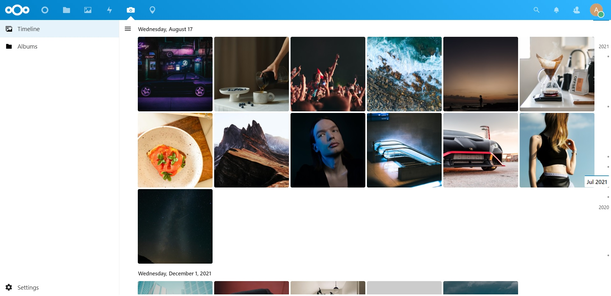

# Memories: Photo Management for Nextcloud

Memories is a _batteries-included_ photo management solution for Nextcloud with advanced features

## 🎁 Features

- **📸 Timeline**: Sort photos and videos by date taken, parsed from Exif data.
- **⏪ Rewind**: Jump to any time in the past instantly and relive your memories.
- **🤖 AI Tagging**: Group photos by people and objects, powered by [recognize](https://github.com/nextcloud/recognize) and [facerecognition](https://github.com/matiasdelellis/facerecognition).
- **🖼️ Albums**: Create albums to group photos and videos together. Then share these albums with others.
- **🫱🏻‍🫲🏻 External Sharing**: Share photos and videos with people outside of your Nextcloud instance.
- **📱 Mobile Support**: Work from any device, of any shape and size through the web app.
- **✏️ Edit Metadata**: Edit dates and other metadata on photos quickly and in bulk.
- **📦 Archive**: Store photos you don't want to see in your timeline in a separate folder.
- **📹 Video Transcoding**: Transcode videos and use HLS for maximal performance.
- **🗺️ Map**: View your photos on a map, tagged with accurate reverse geocoding.
- **📦 Migration**: Migrate easily from Nextcloud Photos and Google Takeout.
- **⚡️ Performance**: Do all this very fast. Tested on instances with over a million photos.

## 🚀 Installation

1. Install the app from the Nextcloud [app store](https://apps.nextcloud.com/apps/memories).
1. Perform the recommended [configuration steps](https://memories.gallery/config/).
1. Run `php occ memories:index` to generate metadata indices for existing photos.
1. Open the 📷 Memories app in Nextcloud and set the directory containing your photos.

## 📱 Mobile Apps

- An Android client for Memories is available in early access on [Google Play](https://play.google.com/store/apps/details?id=gallery.memories), [F-Droid](https://f-droid.org/packages/gallery.memories/) or [GitHub Releases](https://github.com/pulsejet/memories/releases?q=android).
- For automatic uploads, you can use the official Nextcloud mobile apps. 
   - Android: [Google Play](https://play.google.com/store/apps/details?id=com.nextcloud.client), [F-Droid](https://f-droid.org/en/packages/com.nextcloud.client/)
   - iOS: [App Store](https://apps.apple.com/us/app/nextcloud/id1125420102).

## 🏗 Development Setup

You can use the dev container to quickly fire up an instance of Nextcloud with Memories pre-installed.
See [`.devcontainer/README.md`](.devcontainer/README.md) for more information.

To set up a development instance manually, follow these steps:

1. ☁ Clone this monorepo into the `custom_apps` folder of your Nextcloud.
1. 📥 Install [Composer](https://getcomposer.org/) and [Node.js 18](https://nodejs.org)
1. 👩‍💻 In a terminal, run the command `make dev-setup` to install the dependencies.
1. 🏗 To build/watch the UI, run `make watch-js`.
1. ✅ Enable the app through the app management of your Nextcloud.
1. ⚒️ (Strongly recommended) use VS Code for development and install these extensions (`Ctrl+Shift+P` > `Show Recommended Extensions`).
   - [PHP Intelephense](https://marketplace.visualstudio.com/items?itemName=bmewburn.vscode-intelephense-client): For PHP intellisense and static analysis
   - [PHP-CS-Fixer](https://marketplace.visualstudio.com/items?itemName=muuvmuuv.vscode-just-php-cs-fixer): For PHP formatting (alternatively, `make php-cs-fixer`)
   - [Psalm](https://marketplace.visualstudio.com/items?itemName=getpsalm.psalm-vscode-plugin): For PHP static analysis (alternatively, `make psalm`)
   - [Prettier](https://marketplace.visualstudio.com/items?itemName=esbenp.prettier-vscode): For autoformatting Vue and Typescript
   - [Volar](https://marketplace.visualstudio.com/items?itemName=Vue.volar): For Vue intellisense and static analysis
1. If using PHP Intelephense, search for `@builtin php-language-features` in the extensions tab and disable it.

This monorepo is organized into the following packages:
- [lib](lib): Backend and database migrations (PHP).
- [src](src): Frontend for all platforms (Vue)
- [go-vod](go-vod): On-demand video transcoder (Go)
- [android](android): Android implemention of NativeX (Kotlin)
- [l10n](l10n): Translations (Transifex)

Releases are organized with these tags:
- `v*`: overall releases (e.g. `v1.0.0` or `v1.0.0-beta.1`)
- `go-vod/*`: transcoder releases (e.g. `go-vod/1.0.0`)
- `android/*`: Android releases (e.g. `android/1.0.0`)

## 🤝 Support the project

1. **🌟 Star this repository**: This is the easiest way to support Memories and costs nothing.
1. **🪲 Report bugs**: Report any bugs you find on the issue tracker.
1. **📖 Translate**: Help translate Memories into your language on [Transifex](https://www.transifex.com/nextcloud/nextcloud/memories/).
1. **📝 Contribute**: Read and file or comment on an issue and ask for guidance.
1. **🪙 Sponsorship**: You can support the project financially at [GitHub Sponsors](https://github.com/sponsors/pulsejet).

A shout out to the current and past financial backers of Memories! See the sponsors page for a full list.

## 📝 Changelog

For the full changelog, see [CHANGELOG.md](CHANGELOG.md).

## 🙏 Special Thanks

To the great folks building Nextcloud, PHP, Vue and all the other dependencies that make this project possible.

Thanks to [GitHub](https://github.com), [CircleCI](https://circleci.com/) and [BrowserStack](https://www.browserstack.com) for sponsorship for Open Source projects for CI / testing on different devices.

## 📄 License

Memories is licensed under the [AGPLv3](COPYING). Subpackages such as [go-vod](go-vod) are licensed under their respective licenses. See the directory of the subpackage for more information.