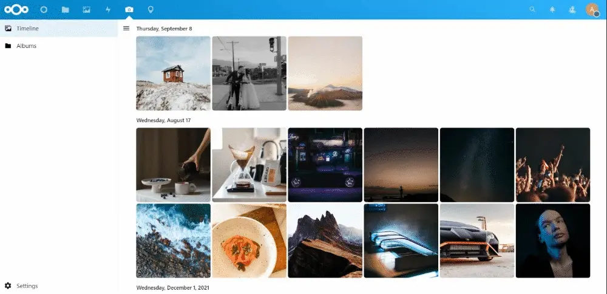

# Memories

**📷 Yet another photo management app for Nextcloud**

## How is this different?

* **📸 Photo and Video Timeline**: Sorts photos by date taken, parsed from Exif data.
* **🤔 Quick Recap**: Jump to anywhere in the timeline instantly.
* **🖼️ Folders**: Browse your and shared folders with a similar, efficient timeline.
* **🎦 Slideshow**: View photos from your timeline and folders easily.
* **📱 Mobile Support**: Relive your memories on devices of any shape and size through the web app.
* **🗑️ Recycle**: Select and delete multiple photos and videos at once.
* **✏️ Edit Metadata**: Edit Exif dates on photos quickly and easily.
* **📦 Archive**: Store photos you don't want to see in your timeline in a separate folder.
* **⚡️ Fast**: Memories is extremely fast. Period. More details below.

## 🚀 Installation

1. Install the app from the Nextcloud app store
1. ⚒️ Install `exiftool` (see below).
1. Run `php ./occ memories:index` to generate metadata indices for existing photos.
1. Open the 📷 Memories app in Nextcloud and set the directory containing your photos. Photos from this directory will be displayed in the timeline, including any photos in nested subdirectories.
1. Installing the [preview generator](https://github.com/rullzer/previewgenerator) for pre-generating thumbnails is strongly recommended.

## 🔨 Installing Dependencies
The exact steps depend on your Nextcloud platform. If you use Docker for your Nextcloud instance, you can install Exiftool by using a custom docker image.
- **Ubuntu/Debian**: `sudo apt install libimage-exiftool-perl`
- **Fedora**: `sudo dnf install perl-Image-ExifTool`
- **Arch Linux**: `sudo pacman -S perl-image-exiftool`
- **Alpine**: `apk add --no-cache exiftool`
- **MacOS**: `brew install exiftool`
- **FreeBSD**: `sudo pkg install p5-Image-ExifTool`

## 🏗 Development setup

1. ☁ Clone this into your `apps` folder of your Nextcloud.
1. 👩‍💻 In a terminal, run the command `make dev-setup` to install the dependencies.
1. 🏗 Then to build the Javascript whenever you make changes, run `make build-js`. To create a pull request use `make build-js-production`. Watch changes with: `make watch-js`.
1. ✅ Enable the app through the app management of your Nextcloud.
1. 🎉 Partytime!

## 🤔 Why a separate app?
The approach of this app is fundamentally different from the official Nextcloud Photos app, which is very lightweight and works entirely using webdav. This app instead maintains special metadata in a separate table on the backend, and thus can be considered to have different objectives.

## ⚡ Performance
- Once properly configured, Memories is **extremely fast**, possibly one of the fastest web photo viewers.
- On a server with relatively cheap hardware (`Intel Pentium G6400 / 8GB RAM / SSD`), loading the timeline takes only `~400ms` without cache on a laptop (`Intel Core i5-1035G1 / Windows 11 / Chrome`) for a library of `~17000 photos` totaling `100GB`. The test was performed on Nextcloud 24 with `nginx`, `php-fpm` and `mariadb` running in Docker.
- For best performance, install the [preview generator](https://github.com/rullzer/previewgenerator) and make sure HTTP/2 is enabled for your Nextcloud instance.

## 📝 Notes
- You may need to configure the Nextcloud preview generator and Imagemagick / ffmpeg to support all types of images and videos (e.g. HEIC). If using the official docker image, add `OC\Preview\HEIC` to `enabledPreviewProviders` in your `config.php`.
- If local time is not found in the photo (especially for videos), the server timezone is used.
- All photos in the timeline _must_ be on a single storage. For example, you cannot have a mounted directory inside your photos directory.
- The app can work with external storage for photos. Just set the mountpoint as the timeline directory.
    - If you add any photos from outside Nextcloud, you must run the scan and index commands.
    - Indexing may be slow, since all files must be downloaded from the storage. The app currently assumes that the Exif data is present with the first 20MB of each file.
    - This function is experimental and may not work as expected. Please report any issues.
- The archive feature moves photos to a separate folder called `.archive` at the root of your timeline. You can use this, for example, to move these photos to a cold storage.

## Special Thanks
Nextcloud team. At least one half of the code is based on the work of the [Nextcloud Photos](https://github.com/nextcloud/photos).